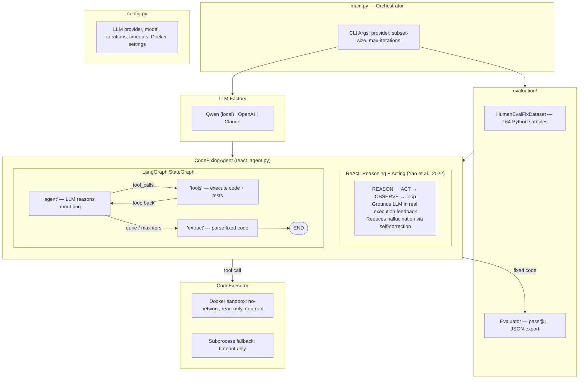

# Architecture: ReAct Code Fixing Agent with LangGraph

## System Architecture

```
┌───────────────────────────────────────────────────────────────────┐
│                     main.py (Orchestrator)                        │
│  CLI args → Load Dataset → Init LLM → Init Agent → Evaluate      │
└──────┬──────────────┬──────────────────────┬──────────────────────┘
       │              │                      │
       ▼              ▼                      ▼
┌────────────┐ ┌──────────────┐  ┌─────────────────────────┐
│ config.py  │ │ LLM Factory  │  │ evaluation/              │
│ provider,  │ │ (llm_factory │  │  dataset.py              │
│ model,     │ │  .py)        │  │   HumanEvalFix loader    │
│ iterations,│ │              │  │   (164 Python samples)   │
│ timeouts,  │ │ • Qwen local │  │  metrics.py              │
│ docker cfg │ │ • OpenAI API │  │   Evaluator (pass@1)     │
└────────────┘ │ • Claude API │  │   JSON result export     │
               └──────┬───────┘  └─────────────────────────┘
                      │
                      ▼
╔═══════════════════════════════════════════════════════════════════╗
║                                                                   ║
║                 CodeFixingAgent (react_agent.py)                   ║
║                                                                   ║
║  ┌─────────────────────────────────────────────────────────────┐  ║
║  │              ReAct Pattern (Yao et al., 2022)               │  ║
║  │                                                              │  ║
║  │  Unlike chain-of-thought (reasoning only) or pure tool use  │  ║
║  │  (acting only), ReAct interleaves BOTH in a closed loop:    │  ║
║  │                                                              │  ║
║  │    REASON → ACT → OBSERVE → REASON → ACT → OBSERVE → ...   │  ║
║  │                                                              │  ║
║  │  REASON:  LLM analyzes buggy code, identifies root cause    │  ║
║  │  ACT:     LLM generates fix, calls execute_code tool        │  ║
║  │  OBSERVE: Agent inspects test results (pass/fail/error)     │  ║
║  │                                                              │  ║
║  │  This grounds reasoning in real execution feedback,          │  ║
║  │  reducing hallucination and enabling self-correction.        │  ║
║  └─────────────────────────────────────────────────────────────┘  ║
║                                                                   ║
║  ┌─────────────────────────────────────────────────────────────┐  ║
║  │            LangGraph StateGraph (Compiled)                  │  ║
║  │                                                              │  ║
║  │  State: messages[] | buggy_code | test_code | fixed_code    │  ║
║  │         iteration  | max_iterations                         │  ║
║  │                                                              │  ║
║  │            ┌─────────────────────┐                           │  ║
║  │            │    "agent" node     │                           │  ║
║  │            │  LLM.invoke()       │◄──────────────┐           │  ║
║  │            │  REASON + plan ACT  │               │           │  ║
║  │            └─────────┬───────────┘               │           │  ║
║  │              _should_continue()                  │           │  ║
║  │               │               │                  │           │  ║
║  │    has tool    │    "end" or   │                  │ loop      │  ║
║  │    calls       │    max iters  │                  │ back      │  ║
║  │               ▼               ▼                  │           │  ║
║  │  ┌──────────────────┐  ┌──────────────┐          │           │  ║
║  │  │  "tools" node    │  │ "extract"    │          │           │  ║
║  │  │  ToolNode:       │  │  Parse fixed │          │           │  ║
║  │  │  ACT + OBSERVE   │──┘  code from   │          │           │  ║
║  │  │  (execute code   │  │  ```python   │          │           │  ║
║  │  │   against tests) │  │  blocks      │          │           │  ║
║  │  └────────┬─────────┘  └──────┬───────┘          │           │  ║
║  │           └───────────────────┼──────────────────┘           │  ║
║  │           (up to 5 iters)     ▼                              │  ║
║  │                          ┌────────┐                          │  ║
║  │                          │  END   │                          │  ║
║  │                          └────────┘                          │  ║
║  └─────────────────────────────────────────────────────────────┘  ║
║                                                                   ║
╚══════════════════════════╤════════════════════════════════════════╝
                           │ tool call
                           ▼
          ┌──────────────────────────────────┐
          │  CodeExecutor (code_executor.py) │
          │  Docker sandbox (preferred)      │
          │    no-network, read-only,        │
          │    non-root, mem/cpu limits      │
          │  Subprocess fallback (timeout)   │
          └──────────────────────────────────┘
```

## Mermaid Diagram (renders on GitHub)


